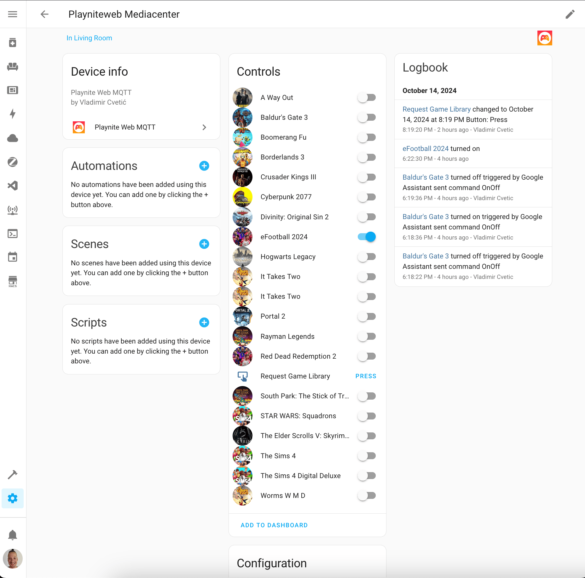
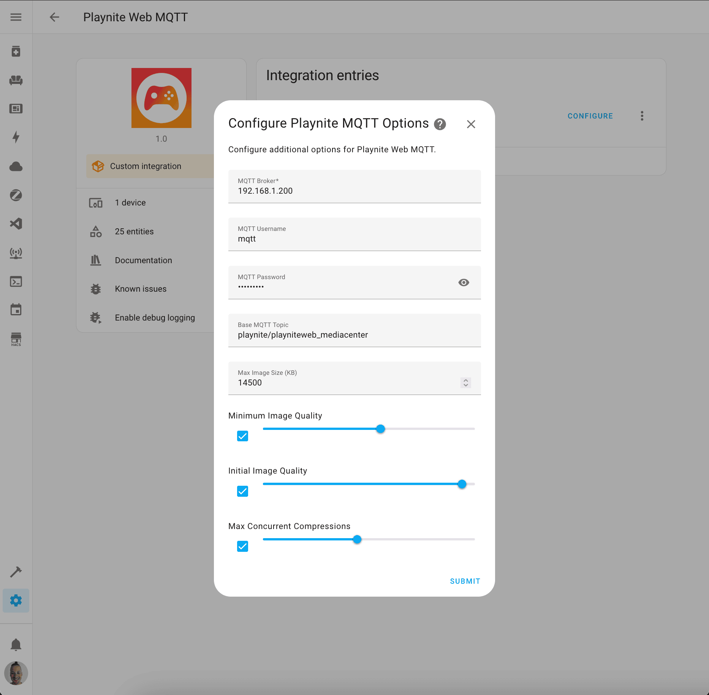

# Playnite Web MQTT Integration

[](https://hacs.xyz/)
[](https://github.com/cvele/playnite_web_mqtt/actions/workflows/validate_hacs.yml)
[](https://github.com/cvele/playnite_web_mqtt/actions/workflows/validate_hassfest.yml)
[](https://github.com/cvele/playnite_web_mqtt/actions/workflows/ci-checks.yml)

> ⚠️ **Warning**: This project is still in development. Use at your own risk!

This custom Home Assistant integration allows you to monitor and control your Playnite games via MQTT. It creates game-related entities (such as switches and buttons) to start, stop, install, and uninstall games, as well as retrieve cover images and game library data from Playnite.



## Table of Contents
- [Playnite Web MQTT Integration](#playnite-web-mqtt-integration)
  - [Table of Contents](#table-of-contents)
  - [Features](#features)
  - [Installation](#installation)
    - [Prerequisites](#prerequisites)
    - [Manual Installation](#manual-installation)
    - [HACS Installation](#hacs-installation)
  - [Configuration](#configuration)
    - [Configuration Options](#configuration-options)
      - [MQTT Settings](#mqtt-settings)
      - [Image Settings](#image-settings)
  - [Supported Entities](#supported-entities)
  - [Example MQTT Topic Structure](#example-mqtt-topic-structure)
  - [Troubleshooting](#troubleshooting)
  - [Known Issues](#known-issues)
  - [License](#license)
  - [Contributions](#contributions)

## Features

- **Game Discovery**: Automatically create switches for games discovered via Playnite's MQTT topics.
- **Game Control**: Control games by turning them on/off (starting/stopping games)
- **User Defined Scripts**: Execute custom scripts before or after a game has started or stopped.
- **Cover Images**: Automatically receive and display cover images for your games.
- **Request Game Library**: Request the game library update from Playnite using a button entity.
- **MQTT-based Communication**: Communicate with Playnite using MQTT to get updates about game states and covers.

## Installation

### Prerequisites
- Playnite with the **PlayniteWeb** plugin configured. (@alex-codes)
- An MQTT broker set up in Home Assistant (e.g., [Mosquitto Broker Add-on](https://www.home-assistant.io/addons/mosquitto/)).

### Manual Installation
1. Copy the `playnite_web_mqtt` directory to your `custom_components` folder in Home Assistant.
   - If you do not have this folder, create it at `<config_dir>/custom_components/playnite_web_mqtt`.
2. Restart Home Assistant.
3. Add and configure the integration via **Configuration** > **Devices & Services** in Home Assistant.

### HACS Installation
1. Open the HACS panel in Home Assistant.
2. Go to **Integrations** and click the three dots in the upper-right corner.
3. Select **Custom repositories** and add the GitHub repository URL of this integration.
4. Search for **Playnite Web MQTT**, and click **Install**.
5. Restart Home Assistant and configure the integration via the UI.

## Configuration

You can configure the integration via the UI in Home Assistant:
1. Go to **Configuration** > **Devices & Services**.
2. Click **Add Integration** and search for **Playnite Web MQTT**.
3. Provide the required MQTT connection details:
   - **MQTT Broker**
   - **MQTT Port**
   - (Optional) **Username** and **Password**
   - **Topic Base**: Set this to the same topic base as configured in Playnite's MQTT Web plugin.

The integration will subscribe to Playnite's MQTT topics, creating game switches and retrieving cover images.



### Configuration Options

#### MQTT Settings

- **MQTT Broker**: The address of your MQTT broker.
- **MQTT Port**: The port for your MQTT broker (default is `1883`).
- **MQTT Username/Password**: (Optional) Credentials for your MQTT broker.
- **Topic Base**: The MQTT topic base, usually in the format `playnite/playniteweb_<your-pc-name>`.

#### Image Settings

The purpose of the image settings (max_image_size, min_quality, and initial_quality) is to ensure that cover images are small enough to fit within the size limits imposed by the platform while maintaining a balance between quality and file size. Here's a breakdown:

- **max_image_size**: The maximum size of images in bytes (default: `14500`).
  The maximum size (in bytes) of images that can be processed and displayed. Each entity in Home Assistant can have a maximum size for associated images to prevent large files from causing performance issues. This setting ensures that the cover images are reduced in size to fit within these limits, which helps prevent errors or slowdowns when loading the images.

- **min_quality**: The minimum JPEG quality to use when sending images (default: `60`).
  Defines the minimum JPEG quality that the integration will use when compressing cover images. If the image needs to be compressed to reduce its size, this setting specifies the lowest quality threshold to maintain a reasonable image appearance. It prevents the image from becoming too pixelated or degraded during compression.

- **initial_quality**: The initial JPEG quality to try before adjusting downwards (default: `95`).
  This is the starting quality for JPEG compression before adjusting downwards if needed. When an image is initially processed, it is compressed at this quality level, and then further adjustments may be made if the resulting image size exceeds the maximum allowed (max_image_size). This ensures that compression starts at a higher quality and progressively reduces until the image fits.

## Supported Entities

- **Switch Entities**:
  - Each game discovered via Playnite is represented as a switch. Turning the switch on starts the game, and turning it off stops the game.
- **Button Entities**:
  - A button to request the game library from Playnite.

## Example MQTT Topic Structure

The integration listens to Playnite MQTT topics structured as follows:

- `playnite/playniteweb_<your-pc-name>/entity/release/<game-id>/state`: Game state (started, stopped).
- `playnite/playniteweb_<your-pc-name>/entity/release/<game-id>/asset/cover`: Game cover image.
- `playnite/playniteweb_<your-pc-name>/response/game/state`: General game state response.

## Troubleshooting

Here are some tips to troubleshoot common issues:

- Ensure your MQTT broker is configured and accessible by both Playnite and Home Assistant.
- Double-check that the MQTT topics match the `topic_base` configured in the Playnite Web plugin.
- Verify your MQTT credentials if authentication is enabled on your broker.

If problems persist, you can enable more detailed logging in Home Assistant's `configuration.yaml` file:

```yaml
logger:
  default: info
  logs:
    custom_components.playnite_web_mqtt: debug
```

## Known Issues

- **Unreliable Switch State**: The state of the switch is not accurate. This is a known issue and stems from the Playnite Web plugin for Playnite. The plugin does not provide a reliable way to determine the game's state at this time. Being worked on.
- **Stopping Games**: Games do not stop when the switch is turned off. This is a known issue and stems from lack of implementation in Playnite it self. Looking for alternative ways to resolve this. For now, workaround is to use user defined script to stop the game. (eg. via HASS.Agent)

## License

This project is licensed under the [MIT License](LICENSE).

## Contributions

We welcome contributions! If you'd like to contribute, feel free to:

1. Fork this repository.
2. Create a new branch with your feature or bug fix.
3. Submit a pull request with a clear description of your changes.

You can also open issues to report bugs or suggest new features.
